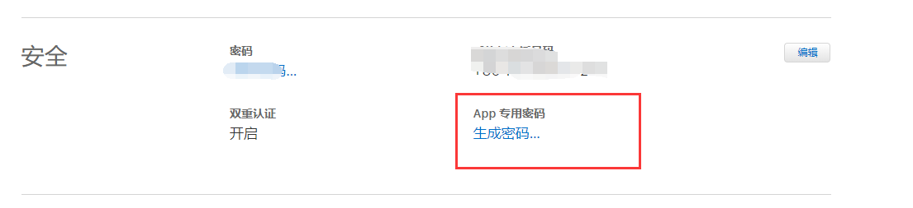
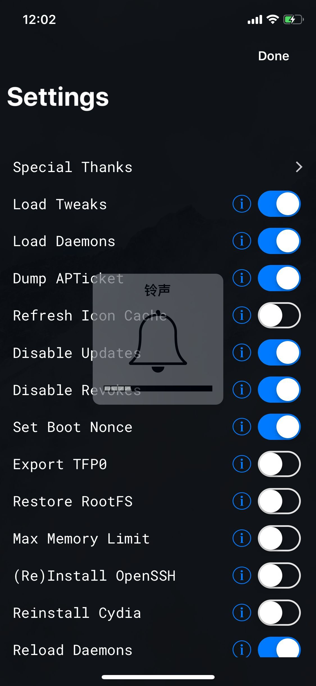
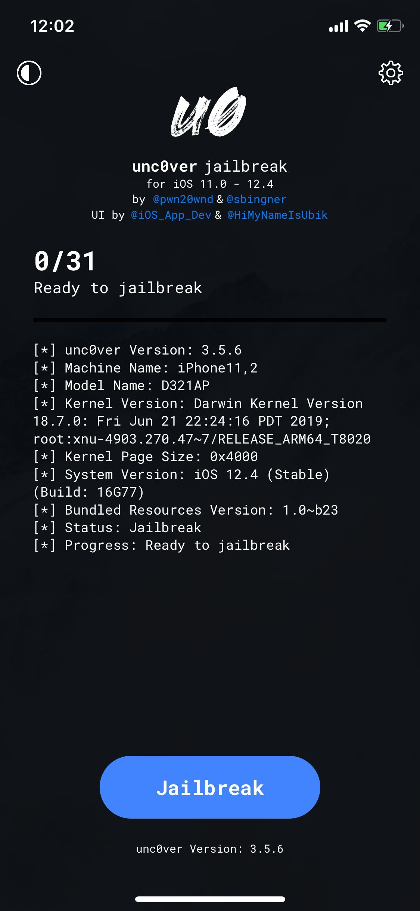

# iphonexs
iphonxs 韩版日版不越狱就可以去掉相机声音 解决方案

### 通过Impactor_0.9.52 安装到你的 Windows 电脑上

> 双击打开soft/Impactor_0.9.52/Impactor.exe

### 插上手机，这个软件就能读取出信息来

1. 然后把两个手机软件一个一个安装拖到这个软件上，进行安装，安装需要AppleId, 输入ID，
2. 然后需要输入密码，就这这个时候输入密码已经不能完成安装，会提示需要提供单一密码，因为最新手机已经是双重认证了，这样你打开苹果地址
https://appleid.apple.com/#!&page=signin 然后登陆你的账号
3. 进入之后创建你的密码

4. 创建之后输入，就等待软件自动完成，桌面就能出现两个软件的图标

5. 打开FilzaEscaped发现无法修改，因为是只读，所以需要先打开unc0ver，点击右上角齿轮图标，按照下图进行选择

按照图中选择的选择

6. 然后选择Done返回主界面，点击蓝色按钮

等待完成然后重启手机
7. 使用FilzaEscaped修改文件
路径：System/Library/Frameworks/MediaToolBox.framework/RegionalSystemSoundsThatShareBehaviour.plist

就是这个文件：RegionalSystemSoundsThatShareBehaviour.plist
修改为RegionalSystemSoundsThatShareBehaviour.plist.bak
就行了

8. 修改完成不要着急试用，先重启手机才能起作用！！！

9. 修改完成不要着急试用，先重启手机才能起作用！！！

10. 修改完成不要着急试用，先重启手机才能起作用！！！

特别感谢软件提供作者：@pwn20wndstuff @AppleDry05